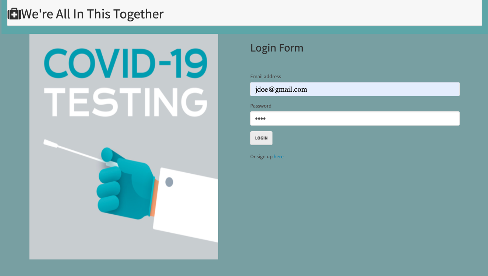
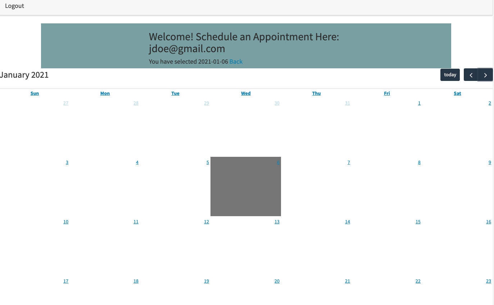

# Stellar Covid Test Scheduler App

## Table of Contents
* [Description](#description)
* [Motivation](#motivation)
* [Visuals](#visuals)
* [Demo](#demo)
* [Installation](#installation)
* [Usage](#usage)
* [Directions for Future Development](#directions-for-future-development)
* [Contributors](#contributors)
* [License](#license)
* [Questions](#questions)

## Description 
An application used to schedule covid tests for anyone who wants to know their status. The individual will sign up using their name, email address, and create a password. If they have already signed up, they will simply login using their email address and password. The app will also show availability and non-availability.

This applciation uses the following technologies: 
`MySQL`, `HTML`, `Node`, `CSS`,  `Passport`, `Bootstrap`, `Javascript`, `Heroku` and `Travis`.

## Motivation
We are all in this together, so knowing your covid status is important so that we can help slow down the spread of the virus.

## Visuals

## Demo
[View Demo](https://drive.google.com/file/d/1rqdkBit1WXB1AjIDloptEWD1lhLlSuVf/view) to watch a live demo of the Stellar Covid Test Scheduler App

[View on Heroku](https://thawing-beach-04875.herokuapp.com/)

## Installation
This application requires no installation to use. Users can access it via [Heroku](https://thawing-beach-04875.herokuapp.com/). 

## Usage
The user of this app would be someone who a user, wants to know their covid status and wants to be able to access a secure site/app so that they can schedule an appointment.

## Directions for future development:
-Add a secure way for users to see their test results 
-Location tracker for testing sites

## Contributors:
* [Latisha](https://github.com/lmmccullum)
* [Kayla](https://github.com/kalynch1292)
* [Zoreah](https://github.com/zoreah)
* [James](https://github.com/jmyardley)
* [Omar](https://github.com/omarcossio)

Code from Bootcamp/uncc-cha-fsf-ft-10-2020-u-c/14-Full-Stack/02-Homework was used as a template for the `Passport` portion of this project. 

## License

Permission to use, copy, modify, and/or distribute this software for any purpose with or without fee is hereby granted, provided that the above copyright notice and this permission notice appear in all copies.

## Questions
* Click this link to see the code on [Github](https://github.com/jmyardley/stellar-app).

